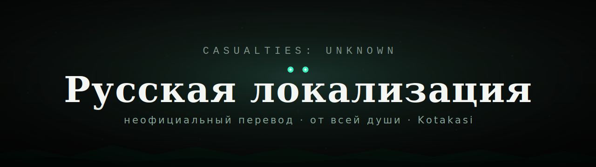

<div align="center">



# Casualties: Unknown — Русская локализация

**Неофициальный, художественный русский перевод игры _Casualties: Unknown_ (Scav Prototype) от Orsoniks.**


[Установка](#-установка) · [Что переведено](#-что-переведено) · [Совместимость](#-совместимость) · [Обратная связь](#-обратная-связь)

</div>


## 🚀 Установка

1. **Перейдите в папку с игрой «Casualties: Unknown».**
   Для Steam: **Библиотека → выберите «Casualties: Unknown» → значок шестерёнки справа → «Управление» → «Посмотреть локальные файлы».**

2. **Поместите файл [`RU-Kotakasi.json`](RU-Kotakasi.json) по пути:**

   ```
   <Папка с игрой>\CasualtiesUnknown_Data\Lang
   ```

   — рядом с файлом `EN.json`.

3. Запустите игру и выберите **«Русский»** в правом верхнем углу главного меню.

> 💡 Имя файла может быть любым — главное, чтобы он лежал в папке `Lang` рядом с `EN.json`. В меню локализация отображается как **«Русский»**.

---

## ✅ Что переведено

Переведены **все** разделы файла локализации:

- **Интерфейс и меню** — кнопки, подсказки, настройки.
- **Предметы, материалы, постройки** — названия и описания.
- **Состояния (moodles)** — голод, жажда, боль, кровопотеря, инфекции и т.д.
- **Реплики персонажа** — весь внутренний монолог Эксперимента (более 1500 строк), а также диалоги двух торговцев (велеречивого и ломаной речи «Дюна»).
- **Записки выживших** — 80+ записок с сохранением характера каждого автора.
- **Логи КПК надзирателей** — отчёты, письма, стенограммы (с сохранением маркеров повреждений данных).
- **Вступительный и обучающий туториал** — полностью.

---


## 💬 Обратная связь

Нашли опечатку, неточность или есть предложение по переводу? Лучше всего написать **напрямую в Телеграм**:

**[@Kotakasi](https://t.me/Kotakasi)**

Можно также открыть [Issue](../../issues) в этом репозитории.

---


## 📄 Лицензия и отказ от ответственности

Это **неофициальный фанатский перевод**. Все права на игру _Casualties: Unknown_ и её содержимое принадлежат **Orsoniks**. Файл перевода распространяется свободно для некоммерческого использования сообществом; при повторной публикации, пожалуйста, сохраняйте упоминание автора. Подробнее — в файле [`LICENSE`](LICENSE).

---

<div align="center">
<sub>Unofficial Russian fan-translation of <b>Casualties: Unknown</b> by Orsoniks. Place <code>RU-Kotakasi.json</code> into <code>CasualtiesUnknown_Data/Lang</code> next to <code>EN.json</code>.</sub>
</div>
